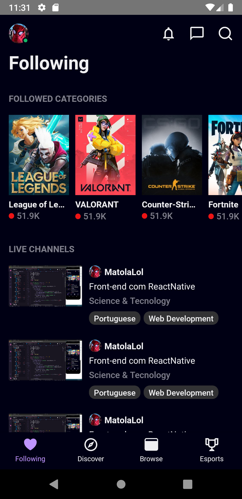
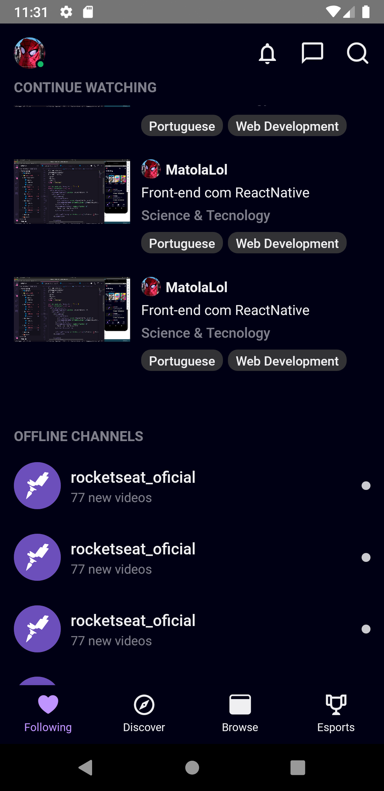

<h1 align="center">
  

  UI Clone - TwitchTV Mobile
</h1>

<p align="center">
  <a href="https://ww.linkedin.com/in/matgomes21/">
    
  </a>
  <a href="" >
    
  </a>
  <a href="" >
    
  </a>
  <a href="" >
    
  </a>
  <a href="" >
    
  </a>
</p>

<p align="center">
  Twitch App Homepage UI clone for study purposes.
</p>


## Screenshots

<p align="center" >
  
  &nbsp&nbsp&nbsp
  
</p>

## Dependencies

- [Yarn](https://yarnpkg.com/)
- [React Native](https://reactnative.dev/)
- [Android Studio](https://developer.android.com/studio)

## How to run

Clone this repository
```bash
$ git clone https://github.com/matgomes21/twitch-clone.git
```
Go to project folder
```bash
$ cd twitch-clone
```
Install dependencies
```bash
$ yarn install
```
Run application
```bash
$ yarn start
```
Emulate the application with Android Studio
```bash
$ yarn android
```

---
<p align="center">
  Made with ❤︎ by <a href="http://github.com/matgomes21">Mateus Gomes</a>
</p>
